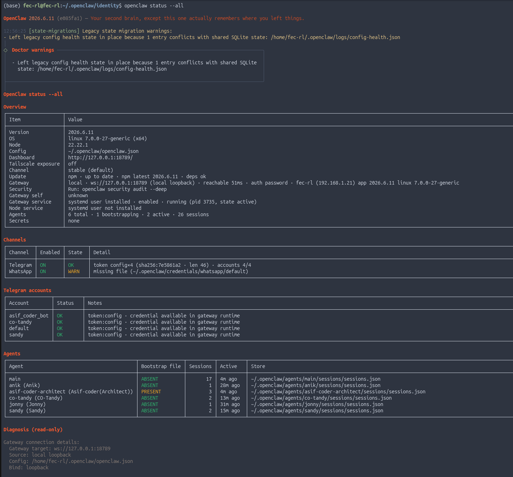
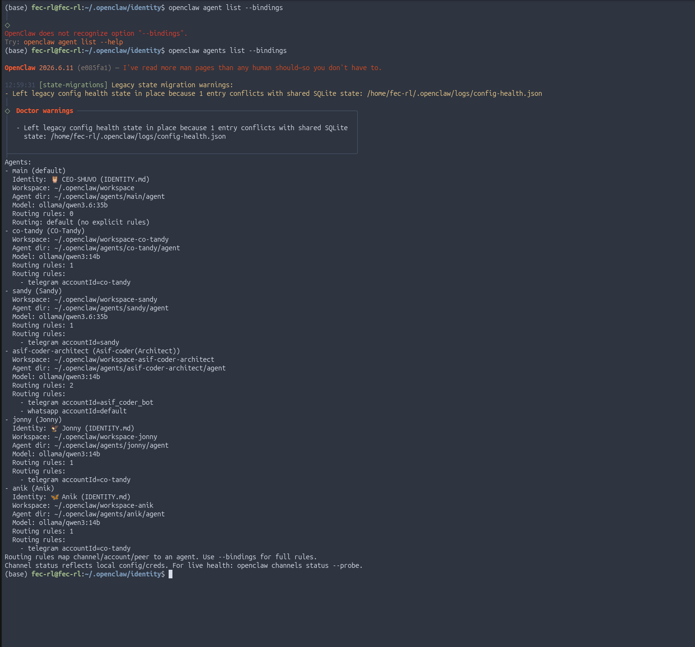

# OpenClaw — Multi-Agent AI Security Orchestration for Universities

    

*A hierarchical multi-agent AI system that automates security operations, system administration, and academic support for a university professors — designed as a real security architecture, not a demo.*


## 1. Overview

Most agentic-AI projects hand an LLM tools and trust it to behave. OpenClaw treats the agent fleet like a real organization instead — role separation, escalation paths, cryptographically verified messaging, and a human who can override anything. No single agent, compromised or not, can act alone on anything critical.


---
## 2. Key Features

| | |
|---|---|
| 🔐 Protocol-layer enforcement | Authority tiers enforced in code, not just prompted |
| 🔑 Task-scoped credentials | AES-256 encrypted, never persisted at root |
| ✍️ Authenticated messaging | HMAC-SHA256 signed, schema-validated |
| 🧠 12 mapped threat vectors | Evaluated against MITRE ATT&CK / ATLAS |
| 📜 Tamper-evident logging | Append-only, SHA-256 hash-chained |
| 🛡️ Fail-safe design | Unresponsive human → logged emergency protocol, never stuck |

---

## 3.Architecture — Authority Hierarchy

```
L0  Founder / Human (madmax)         — Override authority, full control
L1  CEO                              — Business oversight, escalation point
L2  Chief Orchestrator (CO-Tandy)    — Task control & coordination
    CISO (CISO-Mandy)                — Security decision authority
    SysAdmin (Sandy)                 — System operations & monitoring
L3  SOC Manager                      — SOC worker fleet, endpoint security ops
    Dev Project Manager              — Dev worker fleet
    CSE Assistant Manager            — Academic support worker fleet
L4  SOC / Dev / CSE Worker Agents    — Persistent, segmented, scoped execution only
```
<p align="center">
  
  <br/><sub>The hierarchy above as implemented and running.</sub>
</p>
```
```

**4.Role responsibilities & authority:**

| Role | Level | Decision Authority | Execution Authority | Reports To |
|---|---|---|---|---|
| Founder (madmax) | L0 | Full / absolute | Yes, direct | — |
| CEO | L1 | None (business only) | Yes, only after Founder approval | Founder |
| Chief Orchestrator | L2 | Can propose (needs approval) | Yes, only after Founder approval | Founder / CEO |
| CISO | L2 | Yes (security); execution needs Founder approval | Yes, only after Founder approval | Founder |
| SysAdmin | L2 | Can propose (needs approval); root-level privilege, cannot act autonomously on critical ops | Yes, only after Founder approval | Founder, CEO, CISO, Orchestrator |
| SOC / Dev / CSE Manager | L3 | Limited, team-level | Yes, limited scoped actions | Orchestrator, SysAdmin |
| L4 Worker Agents | L4 | None | Yes, limited scoped actions | Their Manager |

<p align="center">
  
  <br/><sub>The hierarchy above as implemented and running.</sub>
</p>

---

## 5.Core Control Flow

Every privileged action follows the same path, regardless of which agent initiates it:

```
Initiator (CISO / Chief Orchestrator / SysAdmin)
        ↓
   Request Approval → Founder → Approve / Reject
        ↓
Execution: SysAdmin OR Founder only

Action Requested
      ↓
Check Type:  Normal → SysAdmin executes | Critical → Founder approval required
      ↓
Approved?  YES → Execute & log   |   NO → Reject, log, escalate
```

**Manager failure handling:** detection (Orchestrator/SysAdmin) → Founder notified → manual intervention required. No silent auto-recovery on a manager-level failure — the human stays in the loop.

<p align="center">
  
  <br/><sub>Authorization request → approval → logged execution, as implemented.</sub>
</p>

---

## 6.Security Model

**Threat coverage:** 12 threat vectors mapped to MITRE ATT&CK / ATLAS (the ATT&CK extension for AI/ML systems) — so defenses are evaluated against known attack techniques, not just "does it work."

**Defense-in-depth layers:**
1. **Prompt injection defense** — regex pre-filter → schema validation → semantic analysis, each independent
2. **Inter-agent message authentication** — HMAC-SHA256 signed; unsigned/mismatched messages rejected before reaching agent logic
3. **Memory isolation** — agents can't read another agent's context outside their authority tier
4. **Rate limiting** — throttles inbound requests and agent-to-agent call volume
5. **Model hash verification** — confirms model/binary matches expected hash before granting execution authority

**Enforcement chain** for any violation or anomaly:
```
Detected → Log (append-only, hash-chained) → Reject the action → Escalate to CISO → Escalate to Founder
```
**Emergency rule:** if Founder and human-in-the-loop are both unresponsive for 15 minutes, CISO + SOC Manager may jointly make an autonomous decision — logged and reviewed retroactively. The system fails safe, never stuck.

<p align="center">
  
  <br/><sub>Layered defenses as deployed.</sub>
</p>

**Credential handling:** task-scoped, not persistent at root level. AES-256 encrypted at rest; key material lives at `.master_key` (`chmod 600`, never committed — enforced by `.gitignore`).

**Audit logging:** append-only JSONL, SHA-256 hash chained — each entry hashes the previous one, so tampering breaks the chain and is detectable.

**Rollback:** any failed setup/deployment step triggers an automatic rollback to the last known-good state, instead of leaving the system half-configured.

---

## 7.Threat Simulation & Testing

The pytest suite includes threat simulations run against each of the 12 mapped vectors, generating IEEE-style metrics (detection rate, false-positive rate, mean time-to-escalation) for the academic writeup.

<p align="center">
  
  <br/><sub>Defense model validated against simulated attacks.</sub>
</p>

```bash
openclaw test
openclaw test --threat-sim   # IEEE-metric-generating threat simulations only
```

---

## 8.Installation

```bash
git clone https://github.com/hot-temper/OpenClaw-multi-agent-system-for-Universities.git
cd OpenClaw-multi-agent-system-for-Universities
pip install -r requirements.txt

openclaw doctor          # verify environment, keys, dependencies
openclaw gateway start   # bring up the agent gateway
openclaw status          # live status of all L0–L4 agents
```

<p align="center">
  
  <br/><sub><code>openclaw status</code> — live fleet status.</sub>
</p>
<p align="center">
  
  <br/><sub>Sandy (SysAdmin) generating a system status report.</sub>
</p>

### 9.Command Reference

| Command | Purpose |
|---|---|
| `openclaw gateway start / stop / restart` | Bring the agent gateway up/down |
| `openclaw status [--agent <name>]` | Live status of all agents, or one agent |
| `openclaw doctor` | Environment/dependency/key health check |
| `openclaw security audit [--fix]` | Audit against 12 mapped threat vectors; `--fix` auto-remediates safe findings |
| `openclaw logs tail / verify` | Tail the audit log / verify the hash chain |
| `openclaw agents list / bindings / inspect <name>` | List agents, role bindings, per-agent detail |
| `openclaw rollback` | Roll back the last failed setup/deployment |
| `openclaw test [--threat-sim]` | Run the pytest suite / threat simulations only |

> ✏️ Confirm exact command names/flags against your `openclaw/cli.py` before publishing.

---

# Agent Roster & WebUI

<p align="center">
  
  <br/><sub>Agent roster management via WebUI.</sub>
</p>
<p align="center">
  
  <br/><sub><code>openclaw agents bindings</code> — role-to-credential bindings.</sub>
</p>

---

## 10.Repository Structure

```
├── Agents/              # Per-agent configs, prompts, roster (L0–L4)
├── skills/              # Self-contained SKILL.md files (Sandy, SOC Manager, …)
├── openclaw/            # Core framework — orchestration, ExecutionBroker, crypto, logging
├── Assets/               # Screenshots referenced above — proof of live implementation
├── LICENSE
└── README.md             # you are here
```

---

## 11. Tech Stack

| Category | Technologies |
|----------|--------------|
| **Programming** | Python · pytest |
| **AI & Local LLMs** | OpenClaw · Ollama · Qwen3.6:35B · Gemma 4:27B · Qwen3:14B |
| **Development** | VS Code · Git · GitHub |
| **Security** | AES-256 · HMAC-SHA256 |
| **Data & Logging** | JSON · JSONL · Hash Chaining |
| **Documentation** | Markdown · Pandoc · PDF Report Generation |
| **SIEM Integration** | Splunk · IBM QRadar · Wazuh |

---
## 12. Author

Built and maintained solo by **Saif Ahmed Shuvo** ([@hot-temper](https://github.com/hot-temper)) — cybersecurity practitioner working across SOC operations, offensive security, and agentic AI system design.

## 13. License & Citation

Licensed under the [MIT License](LICENSE).

```
